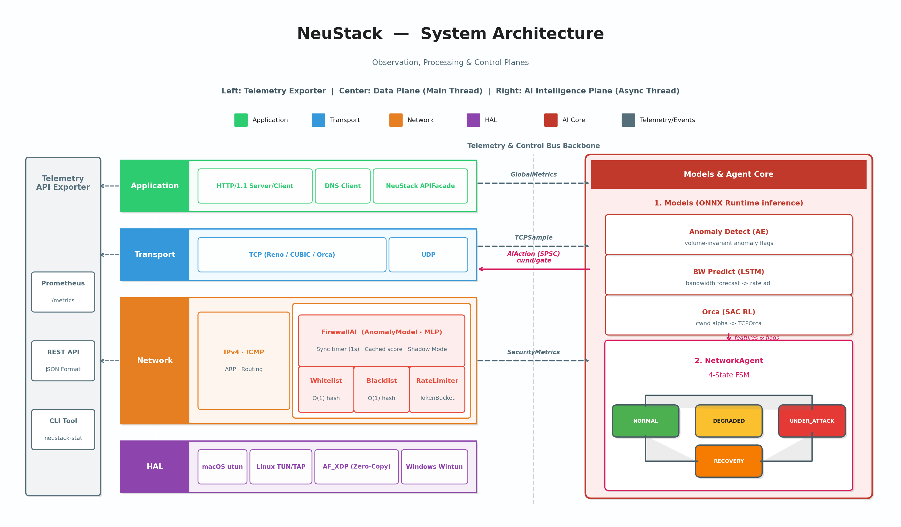
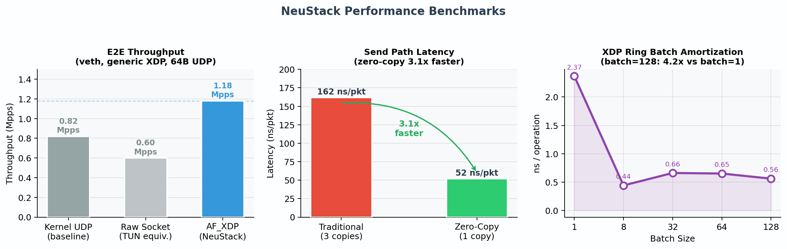
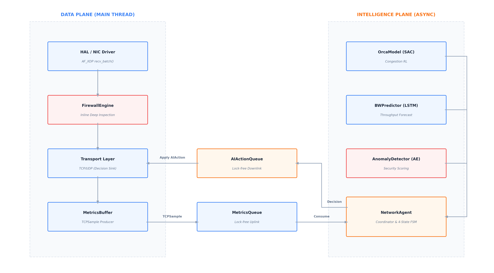

<a name="top"></a>
<h1 align="center">NeuStack</h1>

<p align="center">
  <strong>A high-performance, programmable user-space network stack — built from scratch in C++20.</strong><br>
  <sub>Designed for workloads where kernel overhead matters: AI collective communications, inference serving, HPC data paths, and systems research.</sub>
</p>

<p align="center">
  <a href="https://github.com/bakabaka999/NeuStack/actions"></a>
  <a href="https://isocpp.org/"></a>
  <a href="https://pytorch.org/"></a>
  <a href="https://onnxruntime.ai/"></a>
  
  
  
</p>

<p align="center">
  <a href="docs/project_whitepaper.md"><b>Whitepaper</b></a> &nbsp;·&nbsp;
  <a href="docs/api/"><b>API Docs</b></a> &nbsp;·&nbsp;
  <a href="docs/api/benchmark.md"><b>Benchmarks</b></a> &nbsp;·&nbsp;
  <a href="#roadmap"><b>Roadmap</b></a> &nbsp;·&nbsp;
  <a href="README.zh-CN.md"><b>中文</b></a>
</p>

<br>

<div align="center">

| **Full Protocol Stack** | **AF_XDP Kernel Bypass** | **3 ONNX Models** | **1.45×** | **~10,000** |
|:-:|:-:|:-:|:-:|:-:|
| Ethernet → IPv4 → TCP/UDP → HTTP | batch ring I/O, 1-copy (generic mode) | async AI inference, lock-free feedback | throughput vs kernel UDP | lines of C++20 |

</div>

---

## Table of Contents

- [Table of Contents](#table-of-contents)
- [Overview](#overview)
- [Key Features](#key-features)
- [System Architecture](#system-architecture)
- [Performance](#performance)
- [Quick Start](#quick-start)
  - [Dependencies](#dependencies)
  - [One-Command Setup](#one-command-setup)
  - [Manual Build](#manual-build)
  - [Recommended First Run](#recommended-first-run)
  - [Minimal Example](#minimal-example)
- [AI Intelligence Plane](#ai-intelligence-plane)
  - [Models](#models)
  - [NetworkAgent States](#networkagent-states)
  - [Firewall AI (separate, synchronous)](#firewall-ai-separate-synchronous)
- [AF\_XDP Data Path](#af_xdp-data-path)
- [Firewall](#firewall)
- [Telemetry \& Observability](#telemetry--observability)
- [Benchmarks](#benchmarks)
- [Testing](#testing)
- [Project Structure](#project-structure)
- [Build Options](#build-options)
- [Documentation](#documentation)
- [Roadmap](#roadmap)
- [License](#license)

---

## Overview

NeuStack is a **complete, from-scratch** user-space network stack written in C++20, implementing the full protocol chain — Ethernet → IPv4 → TCP/UDP → HTTP/DNS — with no dependence on the kernel network stack.

**Why user-space?**  The kernel network stack is a general-purpose design optimized for compatibility, not throughput. Moving the stack to user space unlocks:

- **Bypass kernel scheduling and syscall overhead** on the packet fast path
- **Programmable transport semantics** — e.g., custom congestion control tuned per workload
- **Zero-copy data movement** from NIC ring buffers directly to application buffers
- **Full observability** into every layer without kernel tracing overhead

This is directly applicable to workloads where network I/O is a bottleneck: **distributed AI training** (AllReduce / NCCL-style collective comms), **high-throughput inference serving**, **HPC cluster communication**, and **low-latency trading infrastructure**. NeuStack explores the full design space of such a stack — from hardware abstraction to AI-assisted transport.

What makes NeuStack different:

- **AI-native transport**: Three ONNX models (SAC RL · LSTM · Autoencoder) run in a dedicated async inference thread. Congestion control decisions feed back to the data plane through a lock-free SPSC queue — zero inference latency on the hot path
- **AF_XDP kernel bypass**: UMEM shared-memory ring, batch packet I/O, BPF/XDP program loading. Tested in **generic (copy) mode** on commodity hardware — **1.45× over kernel UDP**. Native zero-copy mode is ready for Intel NICs (i40e / ice / igc)
- **Zero-allocation hot path**: FixedPool slab allocator — no `new`/`delete` in the packet processing loop
- **Production observability**: Prometheus/JSON telemetry, 7 live HTTP endpoints, `neustack-stat` live CLI
- **Unified cross-platform HAL**: macOS utun · Linux TUN/TAP + AF_XDP · Windows Wintun — one API
<!-- 
```
C++ Core:        ~10,000 lines  —  protocol stack + AI inference + firewall + AF_XDP HAL
Python Training:  ~4,000 lines  —  SAC / LSTM / Autoencoder training pipelines
Scripts:          ~2,700 lines  —  data collection, benchmarks, environment setup
``` -->

---

## Key Features

| Category | Details |
|----------|---------|
| **Protocol Stack** | IPv4 · ICMP · UDP · TCP · HTTP 1.1 · DNS |
| **Congestion Control** | Reno · CUBIC · **Orca (SAC Reinforcement Learning)** |
| **AI Intelligence Plane** | BW Prediction (LSTM) · Anomaly Detection (AE) · Congestion Control (SAC) · NetworkAgent 4-State FSM |
| **AF_XDP Data Path** | UMEM · Batch Ring I/O · BPF/XDP loading · **Generic copy mode tested**; native zero-copy ready for Intel NICs |
| **Firewall** | O(1) Blacklist/Whitelist · Token Bucket Rate Limiter · AI Shadow Mode · Auto Escalation |
| **Telemetry** | MetricsRegistry · JSON & Prometheus · 7 HTTP endpoints · `neustack-stat` live CLI |
| **Zero-Allocation Hot Path** | FixedPool · no `new`/`delete` in the packet processing loop |
| **Cross-Platform** | macOS (utun) · Linux (TUN/TAP + AF_XDP) · Windows (Wintun) |

<p align="right"><a href="#top">&#8593; Back to top</a></p>

---

## System Architecture

<p align="center">
  
</p>

NeuStack separates packet processing across two planes:

**Data Plane** (main thread): HAL receives packets → FirewallEngine filters → IPv4 routes → TCP/UDP processes → Application delivers. Every layer writes to lock-free atomic metrics.

**AI Intelligence Plane** (async thread): reads `MetricsBuffer<TCPSample>` from data plane → three ONNX models infer → `NetworkAgent` (4-State FSM) decides → writes `AIAction` back via `SPSCQueue`.

<p align="right"><a href="#top">&#8593; Back to top</a></p>

---

## Performance

<p align="center">
  
</p>

| Benchmark | Result | vs Baseline |
|-----------|--------|-------------|
| E2E throughput — AF_XDP **generic/copy mode** | **1.18 Mpps** | **1.45×** over kernel UDP |
| E2E throughput — kernel UDP (SOCK_DGRAM) | 0.82 Mpps | baseline |
| E2E throughput — raw socket (TUN-equivalent) | 0.60 Mpps | 0.73× |
| Zero-copy send path vs traditional 3-copy | **52 vs 162 ns/pkt** | **3.1×** faster |
| XDP Ring ops: batch=1 → batch=128 | 2.37 → 0.55 ns/op | **4.3×** amortization |
| UMEM alloc+free (sequential) | **0.46 ns/op** | near hardware limit |
| TCP `build_header_only()` vs `build()` | 1.9 vs 11.4 ns/op | **6×** faster |

> [!NOTE]
> All E2E benchmarks run in **generic (copy) mode** on veth pairs with a Realtek r8169 NIC, which does **not** support native XDP. The AF_XDP implementation fully supports native zero-copy mode for Intel NICs (i40e / ice / igc), where 5–10× additional throughput gains are expected based on published XDP benchmarks.

<p align="right"><a href="#top">&#8593; Back to top</a></p>

---

## Quick Start

### Dependencies

| Dependency | Required | Notes |
|-----------|----------|-------|
| CMake ≥ 3.20 | Yes | |
| C++20 compiler | Yes | GCC ≥ 11 / Clang ≥ 14 / MSVC 2019+ |
| ONNX Runtime | Optional | AI inference (`-DNEUSTACK_ENABLE_AI=ON`) |
| libbpf + clang | Optional | AF_XDP, Linux only (`-DNEUSTACK_ENABLE_AF_XDP=ON`) |
| Catch2 v3 | Optional | Unit tests |
| Wintun | Windows only | Auto-downloaded by setup script |

### One-Command Setup

```bash
# macOS / Linux
./setup              # with AI
./setup --no-ai      # without AI (faster build)
./setup --with-fuzzers  # build parser fuzz targets and auto-check toolchain
./setup fuzz            # same as above

# Windows (PowerShell as Administrator)
.\setup.bat
```

### Manual Build

```bash
git clone https://github.com/bakabaka999/NeuStack.git
cd NeuStack

# Standard build
cmake -B build -DCMAKE_BUILD_TYPE=Release
cmake --build build --parallel

# Full build with AF_XDP + AI (Linux)
sudo apt install libbpf-dev clang
cmake -B build -DCMAKE_BUILD_TYPE=Release \
    -DNEUSTACK_ENABLE_AF_XDP=ON \
    -DNEUSTACK_ENABLE_AI=ON
cmake --build build --parallel

# Run tests
cd build && ctest --output-on-failure

# Run demo (requires root for TUN/AF_XDP)
sudo ./build/examples/neustack_demo
```

### Recommended First Run

The fastest way to validate a fresh build is the interactive demo plus the built-in telemetry endpoints:

```bash
# Build the demo and CLI tool
cmake -B build -DCMAKE_BUILD_TYPE=Release
cmake --build build --target neustack_demo neustack_stat

# Start the stack (root is required for utun / TUN / AF_XDP)
sudo ./build/examples/neustack_demo --ip 192.168.100.2 -v

# In another terminal, query the telemetry API served by the demo on port 80
curl http://192.168.100.2/api/v1/health
curl http://192.168.100.2/api/v1/stats | python3 -m json.tool

# Live CLI dashboard
./build/tools/neustack-stat --host 192.168.100.2 --port 80 --live
```

On macOS, follow the `scripts/nat/setup_nat.sh` instructions printed by the demo so the host can reach the stack IP.

### Minimal Example

```cpp
#include "neustack/neustack.hpp"

int main() {
    neustack::StackConfig config;
    config.orca_model_path = "models/orca_actor.onnx";  // optional, requires -DNEUSTACK_ENABLE_AI=ON

    auto stack = neustack::NeuStack::create(config);
    if (!stack) return 1;

    // HTTP server
    stack->http_server().get("/", [](const auto&) {
        return neustack::HttpResponse()
            .content_type("text/plain")
            .set_body("Hello from NeuStack!\n");
    });
    stack->http_server().listen(80);

    // Firewall rules
    auto* rules = stack->firewall_rules();
    rules->add_blacklist_ip(neustack::ip_from_string("1.2.3.4"));
    rules->rate_limiter().set_enabled(true);
    rules->rate_limiter().set_rate(1000, 100);

    stack->run();  // blocks until Ctrl+C
}
```

<p align="right"><a href="#top">&#8593; Back to top</a></p>

---

## AI Intelligence Plane

<p align="center">
  
</p>

The AI system runs in a **dedicated async thread** (`IntelligencePlane`), completely decoupled from packet processing. It pulls TCP samples from a lock-free ring buffer, runs three ONNX models, feeds results into `NetworkAgent`, and pushes `AIAction` back to the data plane via SPSC queue — zero blocking on the hot path.

### Models

| Model | Algorithm | Role | Interval |
|-------|-----------|------|----------|
| **Orca** | SAC Reinforcement Learning | Congestion window alpha → `TCPOrca::cwnd()` | 10 ms |
| **BW Predict** | LSTM | Bandwidth forecast → proactive rate adjustment | 100 ms |
| **Anomaly Detect** | Autoencoder | Traffic anomaly scoring → connection gating | 1000 ms |

### NetworkAgent States

| State | Behavior |
|-------|----------|
| `NORMAL` | Full AI-assisted CC, firewall in shadow mode |
| `CONGESTED` | Tighter cwnd clamping, conservative bandwidth target |
| `UNDER_ATTACK` | Connection gate active, firewall escalated to enforce mode |
| `RECOVERING` | Gradual parameter restoration, firewall returning to shadow |

### Firewall AI (separate, synchronous)

Apart from the async `IntelligencePlane`, a second AI model (`SecurityAnomalyModel`, MLP) runs **synchronously on a 1-second timer** in the data plane thread. It scores the traffic using 8 volume-invariant features derived from `SecurityMetrics`, caches the result atomically, and uses the cached score per packet — no per-packet inference overhead.

See [`docs/api/ai-inference.md`](docs/api/ai-inference.md) for model architecture, ONNX configuration, and `NetworkAgent` API. See [`docs/api/ai-training.md`](docs/api/ai-training.md) for training pipelines.

<p align="right"><a href="#top">&#8593; Back to top</a></p>

---

## AF_XDP Data Path

NeuStack implements AF_XDP as its high-performance Linux data path backend.

```
Traditional path (TUN):
  NIC → kernel sk_buff alloc → copy → TUN fd read() → copy → userspace
  2 memory copies, one syscall per packet

AF_XDP path (NeuStack):
  NIC → XDP program (BPF) → UMEM (shared mmap ring) → userspace batch recv
  1 memory copy (generic mode), batch syscall
```

> [!NOTE]
> Tested in **AF_XDP generic (SKB copy) mode** — packets still pass through the kernel sk_buff path before entering the UMEM ring. This is because the test NIC (Realtek r8169) does not support native XDP. The implementation fully supports **native zero-copy mode** (`zero_copy = true`, `force_native_mode = true`) for NICs with XDP driver support (Intel i40e / ice / igc / mlx5).

```bash
# Build with AF_XDP
sudo apt install libbpf-dev clang
cmake -B build -DNEUSTACK_ENABLE_AF_XDP=ON
cmake --build build --parallel
```

See [`docs/api/af-xdp.md`](docs/api/af-xdp.md) for NIC compatibility table, configuration options, and the batch recv/send API.

<p align="right"><a href="#top">&#8593; Back to top</a></p>

---

## Firewall

The firewall runs **inline on every packet** in the data plane, before the network layer.

| Feature | Details |
|---------|---------|
| **Whitelist / Blacklist** | O(1) hash lookup, IP-based |
| **Rate Limiter** | Token Bucket, configurable pps + burst |
| **AI Anomaly Detection** | MLP model, 8 volume-invariant features (SYN ratio, RST ratio, conn completion rate...) |
| **Shadow Mode** | Alert-only, no drops — safe for gradual production rollout |
| **Auto Escalation** | N consecutive anomalies auto-disables shadow mode → enforce mode |
| **API** | `NeuStack::firewall_rules()` facade for programmatic rule management |

See [`docs/api/firewall.md`](docs/api/firewall.md) for full rule engine API, AI anomaly detection configuration, and Shadow Mode details.

<p align="right"><a href="#top">&#8593; Back to top</a></p>

---

## Telemetry & Observability

Every data plane layer writes to lock-free atomic counters (`GlobalMetrics`, `SecurityMetrics`). These are exported via:

| Endpoint | Format | Description |
|----------|--------|-------------|
| `GET /api/v1/health` | JSON | Stack health and uptime |
| `GET /api/v1/stats` | JSON | Full statistics snapshot |
| `GET /api/v1/stats/traffic` | JSON | Packet/byte counters |
| `GET /api/v1/stats/tcp` | JSON | TCP connections, RTT distribution |
| `GET /api/v1/stats/security` | JSON | Firewall hits, anomaly scores |
| `GET /api/v1/connections` | JSON | Active TCP connections |
| `GET /metrics` | Prometheus | Prometheus-compatible scrape endpoint |

```bash
# Live terminal dashboard
./build/tools/neustack-stat --host 127.0.0.1 --port 80

# One-shot stats
curl http://127.0.0.1:80/api/v1/stats | python3 -m json.tool
```

See [`docs/api/telemetry.md`](docs/api/telemetry.md) for full endpoint reference, Prometheus integration, and `neustack-stat` CLI options.

<p align="right"><a href="#top">&#8593; Back to top</a></p>

---

## Benchmarks

```bash
# Build in Release mode
cmake -B build -DCMAKE_BUILD_TYPE=Release \
    -DNEUSTACK_BUILD_BENCHMARKS=ON \
    -DNEUSTACK_ENABLE_AF_XDP=ON \
    -DNEUSTACK_ENABLE_AI=ON
cmake --build build --parallel

# Component micro-benchmarks (5 runs, with statistics)
python3 scripts/bench/benchmark_runner.py --build-dir build/ --runs 5

# Generate publication-quality figures (PDF + PNG + LaTeX table)
python3 scripts/bench/plot_results.py --input bench_results/latest/summary.json
ls bench_results/latest/figures/

# End-to-end throughput: kernel_udp vs raw_socket vs af_xdp (requires root)
sudo bash scripts/bench/run_throughput_test.sh --duration 10 --runs 3
```

See [`docs/api/benchmark.md`](docs/api/benchmark.md) for full details and reproduction instructions.

<p align="right"><a href="#top">&#8593; Back to top</a></p>

---

## Testing

```bash
cd build && ctest --output-on-failure
```

Benchmark executables are optional and require `-DNEUSTACK_BUILD_BENCHMARKS=ON` during configuration.
Parser fuzzers are optional and require `-DNEUSTACK_BUILD_FUZZERS=ON` plus a Clang / AppleClang toolchain with libFuzzer runtime support. On macOS, Command Line Tools alone do not ship `libclang_rt.fuzzer_osx.a`; use `./setup --with-fuzzers` to auto-check and provision a compatible toolchain when possible.

| Suite | Tests |
|-------|-------|
| Common | Checksum · IP address · Ring buffer · SPSC queue · Memory pool · JSON builder |
| HAL | Batch device · Ethernet · UMEM · XDP ring · AF_XDP config · BPF object |
| AI | Feature extraction · NetworkAgent FSM · ONNX model integration |
| Optional Benchmarks | `bench_afxdp_datapath` (micro) · `bench_e2e_throughput` (E2E) when `NEUSTACK_BUILD_BENCHMARKS=ON` |
| Optional Fuzzers | `fuzz_http_parser` · `fuzz_dns_parser` · `fuzz_ipv4_parser` · `fuzz_tcp_parser` when `NEUSTACK_BUILD_FUZZERS=ON` |

<p align="right"><a href="#top">&#8593; Back to top</a></p>

---

## Project Structure

```
NeuStack/
├── include/neustack/          # Public headers
│   ├── hal/                   #   HAL: device.hpp, AF_XDP, UMEM, XDP ring
│   ├── net/                   #   Network: IPv4, ICMP, ARP
│   ├── transport/             #   TCP, UDP, packet builders
│   ├── firewall/              #   FirewallEngine, FirewallAI, RuleEngine
│   ├── ai/                    #   IntelligencePlane, models, NetworkAgent
│   ├── metrics/               #   GlobalMetrics, MetricsRegistry, TelemetryAPI
│   └── neustack.hpp           #   Unified facade
├── src/                       # Implementations
├── tests/
│   ├── unit/                  #   Catch2 unit tests
│   └── benchmark/             #   bench_afxdp_datapath, bench_e2e_throughput
├── fuzz/                      #   libFuzzer harnesses for HTTP, DNS, IPv4, TCP parsers
├── training/                  # Python AI training pipelines
│   ├── congestion/            #   Orca (SAC RL)
│   ├── bandwidth/             #   LSTM bandwidth prediction
│   ├── anomaly/               #   Autoencoder anomaly detection
│   └── security/              #   Security anomaly detection (MLP)
├── scripts/
│   ├── bench/                 #   Benchmark runner, plot generator, E2E test
│   ├── linux/                 #   Data collection scripts
│   └── mac/                   #   macOS data collection
├── tools/
│   ├── neustack_stat.cpp      #   Live telemetry CLI
│   └── udp_flood.cpp          #   High-speed UDP packet generator (sendmmsg)
├── docs/
│   ├── img/                   #   Architecture + perf diagrams
│   ├── api/                   #   af-xdp.md, benchmark.md
│   └── project_whitepaper.md  #   Technical whitepaper
├── bpf/                       # BPF/XDP programs
├── examples/                  # Example programs
└── cmake/                     # CMake modules (BPFCompile)
```

<p align="right"><a href="#top">&#8593; Back to top</a></p>

---

## Build Options

| Option | Default | Description |
|--------|---------|-------------|
| `NEUSTACK_BUILD_TESTS` | ON | Build unit and integration tests |
| `NEUSTACK_BUILD_EXAMPLES` | ON | Build example programs |
| `NEUSTACK_BUILD_BENCHMARKS` | OFF | Build benchmark executables and register benchmark ctest targets |
| `NEUSTACK_BUILD_FUZZERS` | OFF | Build libFuzzer parser fuzz targets and enable sanitizer instrumentation |
| `NEUSTACK_BUILD_TOOLS` | ON | Build CLI tools such as `neustack-stat` |
| `NEUSTACK_ENABLE_ASAN` | OFF | Address Sanitizer |
| `NEUSTACK_ENABLE_UBSAN` | OFF | Undefined Behavior Sanitizer |
| `NEUSTACK_ENABLE_AI` | OFF | AI inference (requires ONNX Runtime) |
| `NEUSTACK_ENABLE_AF_XDP` | OFF | AF_XDP kernel-bypass backend (Linux; requires libbpf + clang) |

<p align="right"><a href="#top">&#8593; Back to top</a></p>

---

## Documentation

| Document | Description |
|----------|-------------|
| [`docs/api/core.md`](docs/api/core.md) | Core API: protocol stack, HTTP server/client, DNS, TCP/UDP |
| [`docs/api/ai-inference.md`](docs/api/ai-inference.md) | AI inference engine, NetworkAgent, ONNX model configuration |
| [`docs/api/ai-training.md`](docs/api/ai-training.md) | SAC / LSTM / Autoencoder training pipelines |
| [`docs/api/firewall.md`](docs/api/firewall.md) | Firewall rule engine, AI anomaly detection, Shadow Mode |
| [`docs/api/telemetry.md`](docs/api/telemetry.md) | Telemetry framework, HTTP endpoints, Prometheus, CLI |
| [`docs/api/af-xdp.md`](docs/api/af-xdp.md) | AF_XDP: NIC compatibility, modes, configuration, API |
| [`docs/api/benchmark.md`](docs/api/benchmark.md) | Benchmark framework: usage, results, reproduction |
| [`docs/api/integration.md`](docs/api/integration.md) | Using NeuStack as a library (CMake, release archives) |
| [`docs/project_whitepaper.md`](docs/project_whitepaper.md) | Full technical whitepaper (v1.5) |

<p align="right"><a href="#top">&#8593; Back to top</a></p>

---

## Roadmap

**v1.5 — Near-term**

- [ ] **Native zero-copy benchmark** — reproduce 3.1× send speedup on Intel NIC (i40e / ice / igc) with `force_native_mode=true`
- [x] **Web Dashboard** — browser-based observability UI backed by the Telemetry HTTP API
- [ ] **Multi-queue AF_XDP** — per-core RX/TX queues for multi-threaded packet processing
- [ ] **AI Benchmark Suite** — latency/throughput profiling of each ONNX model under sustained load
- [x] **TLS / HTTPS support** — mbedTLS-backed TLS layer with transparent HTTPS server/client via `TLSLayer` decorator over TCP
- [x] **HTTP chunked transfer support** — client parser consumes chunked responses; server emits standards-compliant chunked streams for unknown-size bodies
- [x] **Parser fuzzing** — libFuzzer harnesses cover HTTP, DNS, IPv4, and TCP parsing hot paths with ASAN/UBSAN integration
- [x] **UDP ICMP error propagation** — deliver ICMP unreachable / time-exceeded metadata to bound UDP consumers
- [x] **TCP ICMP error propagation** — surface ICMP unreachable / time-exceeded failures to TCP connect and stream-close consumers
- [x] **Retransmit telemetry** — export TCP retransmit counters through `GlobalMetrics` / Telemetry API

**v2.0 — AI Infra Transport Layer**

- [ ] **AllReduce transport** — Ring/Tree-AllReduce collective communication over NeuStack, targeting distributed AI training (NCCL-style workloads)
- [ ] **GPU↔NIC zero-copy** — DMA-BUF / GPUDirect RDMA integration, eliminating CPU copies on the training data path
- [ ] **LLM Agent integration** — natural-language network diagnostics via live Telemetry API, automated anomaly explanation and remediation
- [ ] **Distributed AI training benchmark** — NeuStack transport vs kernel TCP for AllReduce throughput and latency
- [ ] **RDMA / RoCE backend** — HAL extension for RDMA-capable NICs

## License

[MIT License](LICENSE)

<p align="right"><a href="#top">&#8593; Back to top</a></p>

---

<p align="center">
  <sub>Made with ❤️ by <a href="https://github.com/bakabaka999">bakabaka999</a></sub>
</p>
